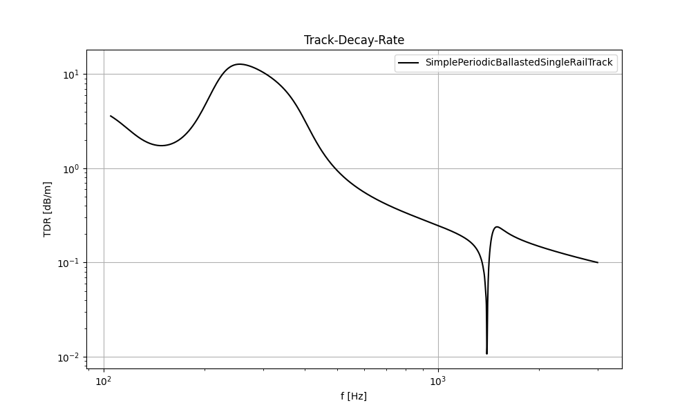

<picture>
  <source srcset="docs/source/images/logo_rolland_light.svg" media="(prefers-color-scheme: dark)">
  
</picture>


[](https://github.com/mantelmax/rolland)
[](https://rolland-rolling-noise-and-dynamics.readthedocs.io/en/latest/?badge=latest)
[](https://www.python.org/)


# Rolland
Rolling Noise and Dynamics (Rolland) is an advanced simulation and calculation model designed to analyze, predict, 
and optimize the acoustic properties of railway tracks, with a focus on realistic, efficient, and fast computations. 

# Features
**Current Features:**
- Calculates the track response for a non-moving gaussian impulse at a certain position
- Applies Finite Difference Method in time domain
- Allows the definition of arbitrary track structures
  - Enables periodic or stochastic variations of the track properties (e.g. stochastically varying sleeper distances)
  - Enables the representation of track property deviations that occur in practise
- Includes several analytical models for comparison and validation

**Planned Features:**
- Full rail dynamics
- Consideration of rail radiation
- Consideration of non-linear effects
- Excitation by multiple moving wheels

<picture>
  <source srcset="docs/source/images/mwi_github_dark.png" media="(prefers-color-scheme: dark)">
  
</picture>

# Documentation
Documentation is available [here](https://rolland-rolling-noise-and-dynamics.readthedocs.io) with a 
how to section and examples.

# Example
This example calculates the track response of a double layer track with discrete mounting positions.
The track is excited between two sleepers with a Gaussian impulse.

```python
"""
Example: Track Vibration Analysis using Rolland API

This example demonstrates how to:
    1. Create a railway track model
    2. Apply excitation and boundary conditions
    3. Run a vibration simulation
    4. Analyze and plot the results
"""

# Import required components from Rolland library
from rolland import DiscrPad, Sleeper, Ballast
from rolland.database.rail.db_rail import UIC60  # Standard rail profile
from rolland import SimplePeriodicBallastedSingleRailTrack
from rolland import (
    PMLRailDampVertic, 
    GaussianImpulse, 
    DiscretizationEBBVerticConst, 
    DeflectionEBBVertic
)
from rolland.postprocessing import Response as resp, TDR

# 1. TRACK DEFINITION ----------------------------------------------------------
# Create a ballasted single rail track model with periodic supports
track = SimplePeriodicBallastedSingleRailTrack(
    rail=UIC60,                 # Standard UIC60 rail profile
    pad=DiscrPad(
        sp=[180e6, 0],          # Stiffness properties [N/m]
        dp=[18000, 0]           # Damping properties [Ns/m]
    ),
    sleeper=Sleeper(ms=150),    # Sleeper mass [kg]
    ballast=Ballast(
        sb=[105e6, 0],          # Ballast stiffness [N/m]
        db=[48000, 0]           # Ballast damping [Ns/m]
    ),
    num_mount=243,              # Number of discrete mounting positions
    distance=0.6                # Distance between sleepers [m]
)

# 2. SIMULATION SETUP ---------------------------------------------------------
# Define boundary conditions (Perfectly Matched Layer absorbing boundary)
boundary = PMLRailDampVertic(l_bound=33.0)  # 33.0 m boundary domain

# Define excitation (Gaussian impulse between sleepers at 71.7m)
excitation = GaussianImpulse(x_excit=71.7)

# 3. DISCRETIZATION & SIMULATION ----------------------------------------------
# Set up numerical discretization parameters
discretization = DiscretizationEBBVerticConst(
    track=track,
    bound=boundary,
)

# Run the simulation and calculate deflection over time
deflection_results = DeflectionEBBVertic(
    discr=discretization, 
    excit=excitation
)

# 4. POSTPROCESSING & VISUALIZATION -------------------------------------------
# 4.1 Calculate frequency response at excitation point
response = resp(results=deflection_results)

# Plot mobility frequency response
resp.plot(
    [(response.freq, abs(response.mob))],
    ['SimplePeriodicBallastedSingleRailTrack'],
    title='Frequency Response',
    x_label='Frequency [Hz]',
    y_label='Mobility [m/Ns]',
)

# 4.2 Calculate Track Decay Rate (TDR)
tdr = TDR(results=deflection_results)

# Plot TDR
resp.plot([(tdr.freq, tdr.tdr)],
    ['SimplePeriodicBallastedSingleRailTrack'],
    title='Track-Decay-Rate',
    x_label='f [Hz]',
    y_label='TDR [dB/m]',
    plot_type='loglog')
```



