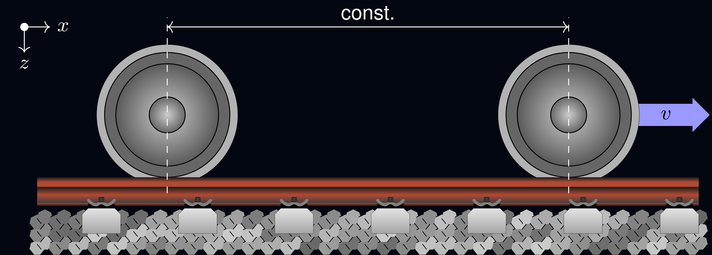

# Rolland

Rolling Noise and Dynamics (Rolland) is an advanced simulation and calculation model designed to analyze, predict, and optimize the acoustic properties of railway tracks, with a focus on realistic, efficient, and fast computations. 

# Features

# Documentation
Documentation is available [here](https://rolland-rolling-noise-and-dynamics.readthedocs.io) with a getting started section and examples.

# Example
