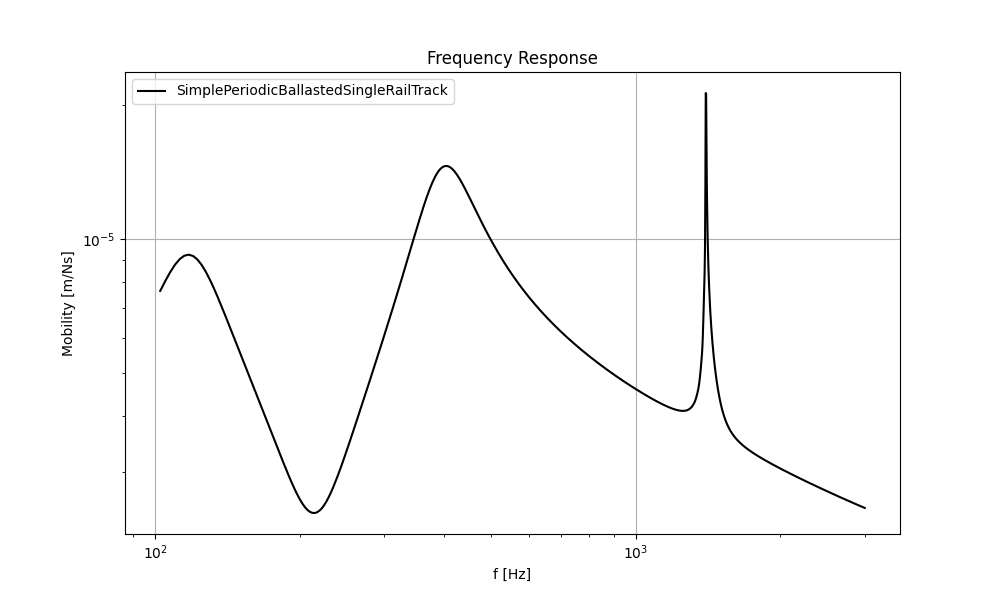

[](https://github.com/mantelmax/rolland)
[](https://rolland-rolling-noise-and-dynamics.readthedocs.io/en/latest/?badge=latest)
[](https://www.python.org/)


# Rolland
Rolling Noise and Dynamics (Rolland) is an advanced simulation and calculation model designed to analyze, predict, 
and optimize the acoustic properties of railway tracks, with a focus on realistic, efficient, and fast computations. 

# Features
**Current Features:**
- Applies Finite Difference Method in time domain
- Allows the definition of arbitrary track structures
  - Enables periodic or stochastic variations of the track properties (e.g. stochastically varying sleeper distances)
  - Enables the representation of track property deviations that occur in practise
- Includes several analytical models for comparison and validation

**Planned Features:**
- Full rail dynamics
- Consideration of rail radiation
- Consideration of non-linear effects
- Excitation by multiple moving wheels


# Documentation
Documentation is available [here](https://rolland-rolling-noise-and-dynamics.readthedocs.io) with a 
how to section and examples.

# Example
```python
# Import components
from rolland import DiscrPad, Sleeper, Ballast
# Import rail
from rolland.database.rail.db_rail import UIC60
# Import double layer track with descrete mounting positions
from rolland import SimplePeriodicBallastedSingleRailTrack
# Import classes required for numerical simulation
from rolland import GridFDMStampka, PMLStampka, GaussianImpulse, DiscretizationFDMStampkaConst, DeflectionFDMStampka
# import postprocessing functions
from rolland.postprocessing import response_fdm, plot

# Define track
track = SimplePeriodicBallastedSingleRailTrack(
      rail=UIC60,
      pad=DiscrPad(sp=[180*10**6, 0], dp=[18000, 0]),
      sleeper=Sleeper(ms=150),
      ballast=Ballast(sb=[105*10**6, 0], db=[48000, 0]),
      num_mount=243,
      distance=0.6)

# Define grid
grid = GridFDMStampka(track = track, dt=2e-5, req_l=80, req_simt=0.4, bx=1, n_bound=600)

# Define boundary domain (Perfectly Matched Layer)
bound = PMLStampka(grid=grid)

# Define excitation (Gaussian Impulse)
excit = GaussianImpulse(grid=grid)

# Discretize
discr = DiscretizationFDMStampkaConst(bound=bound)

# Run simulation and calculate deflection over time (excitation at 71.7m)
defl = DeflectionFDMStampka(discr=discr, excit=excit, x_excit=71.7)

# Postprocessing: Calculate frequency response at x = x_excit (receptance, mobility, accelerance)
fftfre, rez, mob, accel = response_fdm(defl)

# Plot the results
plot([(fftfre, mob)],
   ['SimplePeriodicBallastedSingleRailTrack'],
    'Frequency Response', 'f [Hz]', 'Mobility [m/Ns]')
```

