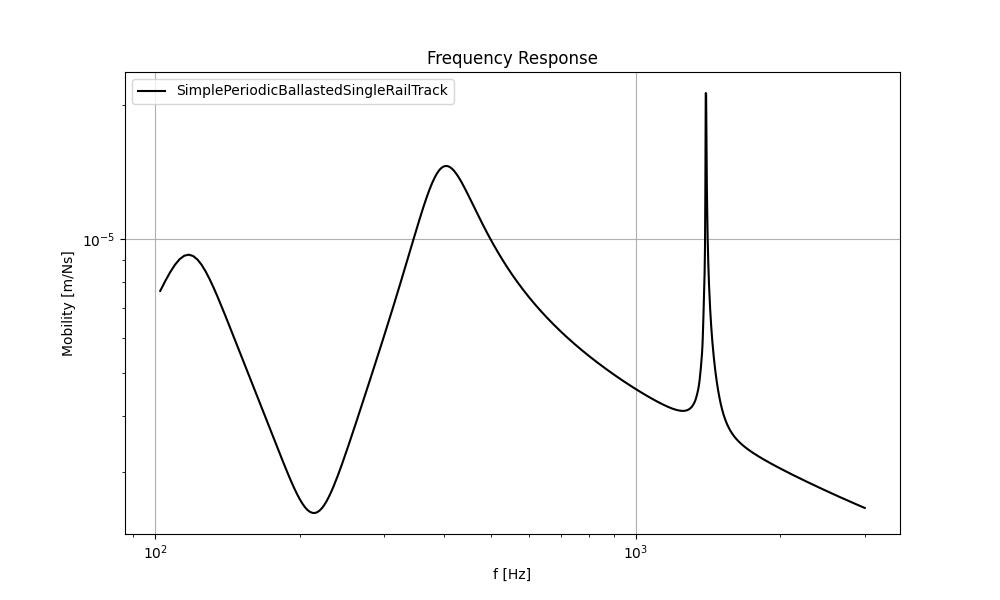

.. _quick_start:

First Simulation
================

This example demonstrates how to set up and run a basic simulation using the Rolland library to calculate the
frequency response of a simple railway track.

.. code-block:: python
  :caption: Python Code
  :linenos:

    """
    Example: Track Vibration Analysis using Rolland API

    This example demonstrates how to:
        1. Create a railway track model
        2. Apply excitation and boundary conditions
        3. Run a vibration simulation
        4. Analyze and plot the results
    """

    # Import required components from Rolland library
    from rolland import DiscrPad, Sleeper, Ballast
    from rolland.database.rail.db_rail import UIC60  # Standard rail profile
    from rolland import SimplePeriodicBallastedSingleRailTrack
    from rolland import (
        PMLRailDampVertic,
        GaussianImpulse,
        DiscretizationEBBVerticConst,
        DeflectionEBBVertic
    )
    from rolland.postprocessing import Response as resp

    # 1. TRACK DEFINITION ----------------------------------------------------------
    # Create a ballasted single rail track model with periodic supports
    track = SimplePeriodicBallastedSingleRailTrack(
        rail=UIC60,                 # Standard UIC60 rail profile
        pad=DiscrPad(
            sp=[180e6, 0],          # Stiffness properties [N/m]
            dp=[18000, 0]           # Damping properties [Ns/m]
        ),
        sleeper=Sleeper(ms=150),    # Sleeper mass [kg]
        ballast=Ballast(
            sb=[105e6, 0],          # Ballast stiffness [N/m]
            db=[48000, 0]           # Ballast damping [Ns/m]
        ),
        num_mount=243,              # Number of discrete mounting positions
        distance=0.6                # Distance between sleepers [m]
    )

    # 2. SIMULATION SETUP ---------------------------------------------------------
    # Define boundary conditions (Perfectly Matched Layer absorbing boundary)
    boundary = PMLRailDampVertic(l_bound=33.0)  # 33.0 m boundary domain

    # Define excitation (Gaussian impulse between sleepers at 71.7m)
    excitation = GaussianImpulse(x_excit=71.7)

    # 3. DISCRETIZATION & SIMULATION ----------------------------------------------
    # Set up numerical discretization parameters
    discretization = DiscretizationEBBVerticConst(
        track=track,
        bound=boundary,
    )

    # Run the simulation and calculate deflection over time
    deflection_results = DeflectionEBBVertic(
        discr=discretization,
        excit=excitation
    )

    # 4. POSTPROCESSING & VISUALIZATION -------------------------------------------
    # Calculate frequency response at excitation point
    response = resp(results=deflection_results)

    # Plot mobility frequency response
    resp.plot(
        [(response.freq, abs(response.mob))],
        ['SimplePeriodicBallastedSingleRailTrack'],
        title='Frequency Response',
        x_label='Frequency [Hz]',
        y_label='Mobility [m/Ns]',
    )

