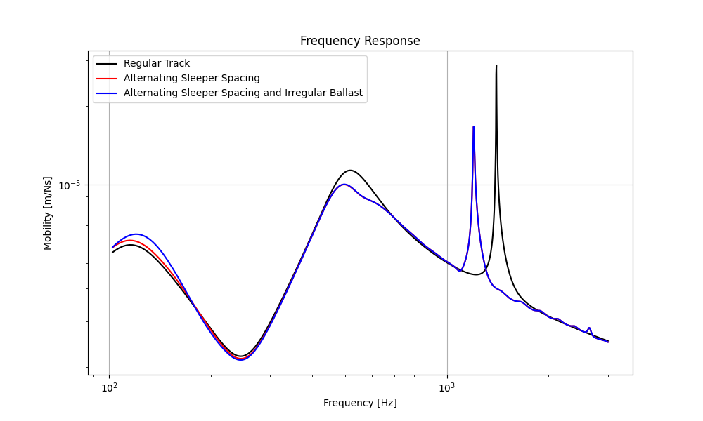

.. _variation:

Apply Structural Disorder
=========================
Structural disorder in railway tracks can significantly affect the vibration characteristics of the track
(see :cite:t:`mantel2024`). This example demonstrates how to set up and run a basic simulation using the Rolland library
to calculate the frequency response of different railway tracks with varying structural properties.

.. note:: This example only determines the track response and the TDR (Track Decay Rate) for a single excitation point!
            It is recommended to average the results over multiple excitation points to obtain a more accurate
            representation of the track's response.

.. code-block:: python
  :caption: Python Code
  :linenos:

    """
    Comparative Track Vibration Analysis using Rolland API

    This example demonstrates a comparison of vibration characteristics for:
        1. Discrete ballasted track (equally spaced mounting positions, equal mounting properties)
        2. Discrete ballasted track (non-uniform mounting positions, equal mounting properties)
        3. Discrete ballasted track (non-uniform mounting positions, irregular ballast stiffness)
    """

    # Import required components from Rolland library
    from rolland.postprocessing import Response as resp
    from rolland.postprocessing import TDR
    from rolland import (
        ContSlabSingleRailTrack,
        ContBallastedSingleRailTrack,
        SimplePeriodicSlabSingleRailTrack,
        SimplePeriodicBallastedSingleRailTrack, ArrangedBallastedSingleRailTrack, PeriodicArrangement, RandomArrangement
    )
    from rolland import DiscrPad, Sleeper, Ballast, ContPad, Slab
    from rolland import PMLRailDampVertic, DiscretizationEBBVerticConst
    from rolland import DeflectionEBBVertic, GaussianImpulse
    from rolland.database.rail.db_rail import UIC60

    # 1. TRACK DEFINITIONS ---------------------------------------------------------

    pad = DiscrPad(sp=[300*10**6, 0], dp=[30000, 0])    # Pad instance
    sleep = Sleeper(ms=150)                             # Sleeper instance
    ball = Ballast(sb=[100*10**6, 0], db=[80000, 0])    # Ballast instance
    dist1 = 0.6                                         # 1st sleeper spacing [m]
    dist2 = 0.7                                         # 2nd sleeper spacing [m]

    num_mount = 243

    # 1.1 Discrete ballasted track (equally spaced mounting positions, equal mounting properties)
    track1 = SimplePeriodicBallastedSingleRailTrack(
        rail=UIC60,                                         # Standard rail profile
        pad=pad,
        sleeper=sleep,
        ballast=ball,
        num_mount=num_mount,                                # Number of mounting positions
        distance=dist1
    )

    # 1.2 Discrete ballasted track (non-uniform mounting positions, equal mounting properties)
    track2 = ArrangedBallastedSingleRailTrack(
        rail=UIC60,
        pad=PeriodicArrangement(item=[pad]),                # No irregularity due to single item
        sleeper=PeriodicArrangement(item=[sleep]),
        ballast=PeriodicArrangement(item=[ball]),
        num_mount=num_mount,
        distance=PeriodicArrangement(item=[dist1, dist2])   # Periodic alternation of dist1 and dist2
    )

    # 1.3 Discrete ballasted track (non-uniform mounting positions, irregular ballast stiffness)

    # Generate normal distributed Ballast instances
    ball_normal = [Ballast(
                sb=[RandomArrangement.trunc_norm(mean=100, sd=30, minv=70, max_v=130) * 10 ** 6, 0],
                db=[80000, 0]
                ) for _ in range(num_mount)]

    track3 = ArrangedBallastedSingleRailTrack(
        rail=UIC60,
        pad=RandomArrangement(item=[pad]),
        sleeper=RandomArrangement(item=[sleep]),
        ballast=RandomArrangement(item=ball_normal),    # Insert list of Ballast instances
        num_mount=num_mount,
        distance=PeriodicArrangement(item=[dist1, dist2]),
    )

    # 2. BOUNDARY CONDITIONS ------------------------------------------------------
    # Perfectly Matched Layer absorbing boundaries
    bound = PMLRailDampVertic(l_bound=33.0)             # 33.0 m boundary domain

    # 3. EXCITATION SETUP ---------------------------------------------------------
    # Gaussian impulse at the same position for all tracks
    x_excit = 71.7                                      # Excitation position [m]
    excit = GaussianImpulse(x_excit=x_excit)

    # 4. SIMULATION SETUP & EXECUTION ----------------------------------------------
    # Discretize and simulate each track type
    discr1 = DiscretizationEBBVerticConst(track=track1, bound=bound)
    discr2 = DiscretizationEBBVerticConst(track=track2, bound=bound)
    discr3 = DiscretizationEBBVerticConst(track=track3, bound=bound)

    defl1 = DeflectionEBBVertic(discr=discr1, excit=excit)
    defl2 = DeflectionEBBVertic(discr=discr2, excit=excit)
    defl3 = DeflectionEBBVertic(discr=discr3, excit=excit)

    # 5. POSTPROCESSING & COMPARISON ----------------------------------------------
    # 5.1 Calculate frequency responses for each track at the excitation point
    pp1 = resp(results=defl1)
    pp2 = resp(results=defl2)
    pp3 = resp(results=defl3)

    resp.plot(
        [(pp1.freq, abs(pp1.mob)),
         (pp2.freq, abs(pp2.mob)),
         (pp3.freq, abs(pp3.mob))],
        ['Regular Track',
         'Alternating Sleeper Spacing',
         'Alternating Sleeper Spacing and Irregular Ballast'],
        title='Frequency Response',
        x_label='Frequency [Hz]',
        y_label='Mobility [m/Ns]',
    )

    # 5.2 Calculate Track Decay Rate (TDR) for each track
    tdr1 = TDR(results=defl1)
    tdr2 = TDR(results=defl2)
    tdr3 = TDR(results=defl3)

    # Plot TDR for each track type
    TDR.plot([(tdr1.freq, tdr1.tdr), (tdr2.freq, tdr2.tdr), (tdr3.freq, tdr3.tdr)],
             ['Regular Track',
              'Alternating Sleeper Spacing',
              'Alternating Sleeper Spacing and Irregular Ballast'],
         'Track-Decay-Rate', 'f [Hz]', 'TDR [dB/m]', plot_type='loglog')

