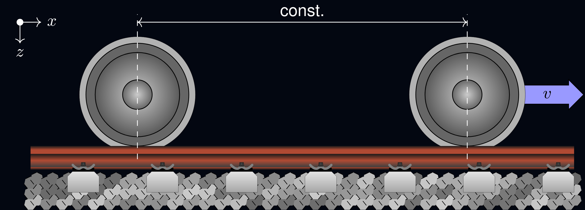

Rolland
========================

.. note:: This repository is still under development!

Rolling Noise and Dynamics (**Rolland**) is an advanced simulation and calculation model designed to analyze, predict, and optimize the acoustic properties of railway tracks, with a focus on realistic, efficient, and fast computations.

Explore
-------

.. tab-set::

   .. tab-item:: How to

      In the **How-to** section, you can learn more about the basic usage of Rolland.

      .. toctree::
         :caption: How to
         :maxdepth: 1
         :titlesonly:

         start

   .. tab-item:: Build Track

      The **Build Track** section contains all classes and functions to create a track model.

      .. toctree::
         :caption: Build Track
         :maxdepth: 1
         :titlesonly:

         buildtrack/components
         buildtrack/track
         buildtrack/arrangement

   .. tab-item:: Rolland

      The **Rolland** section contains all classes and functions corresponding to the Rolland model.

      .. toctree::
         :caption: Rolland
         :maxdepth: 1
         :titlesonly:

         rolland/grid
         rolland/boundary
         rolland/excitation
         rolland/discretization
         rolland/deflection
         rolland/abc_traitlets

   .. tab-item:: Other Models

      This section contains several analytical and numerical models in order to compare the results of the
      Rolland model.

      .. toctree::
         :caption: Other Models
         :maxdepth: 1
         :titlesonly:

         other_models/analyticalmethods

   .. tab-item:: Postprocessing

      The **Postprocessing** section contains all classes and functions to postprocess the results of
      the Rolland model and the analytical methods.

      .. toctree::
         :caption: Postprocessing
         :maxdepth: 1
         :titlesonly:

.. toctree::
   :hidden:
   :caption: Literature

   literature/index